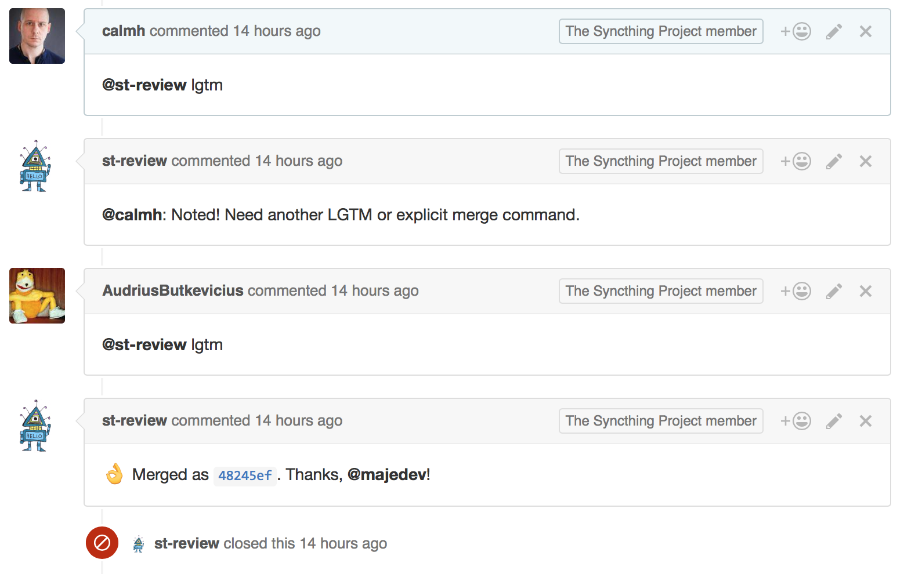
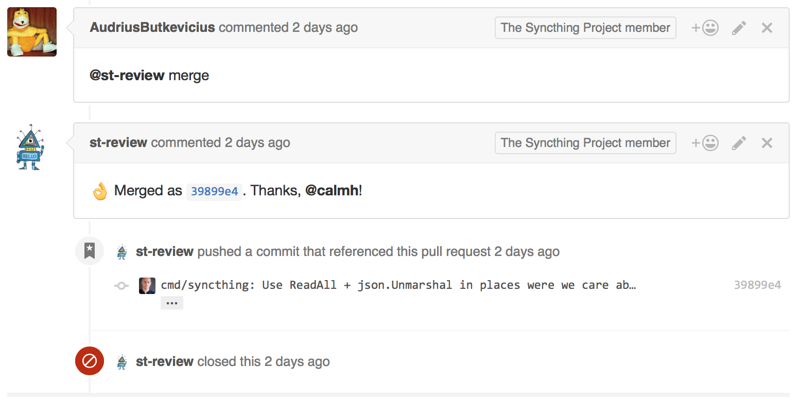
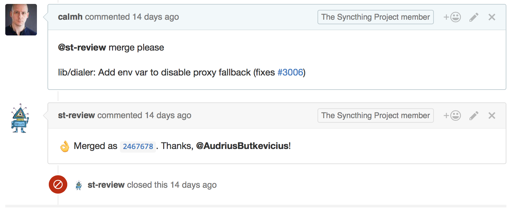
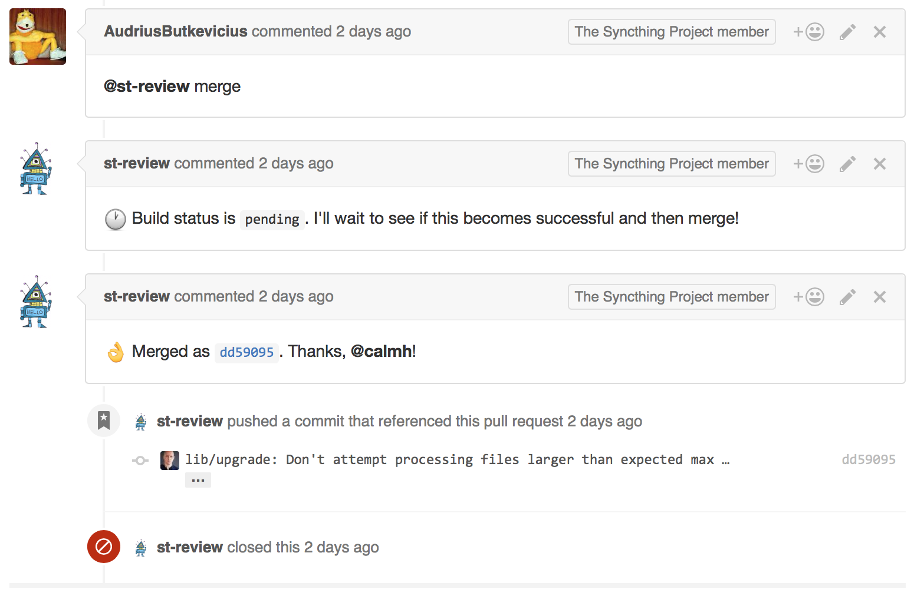
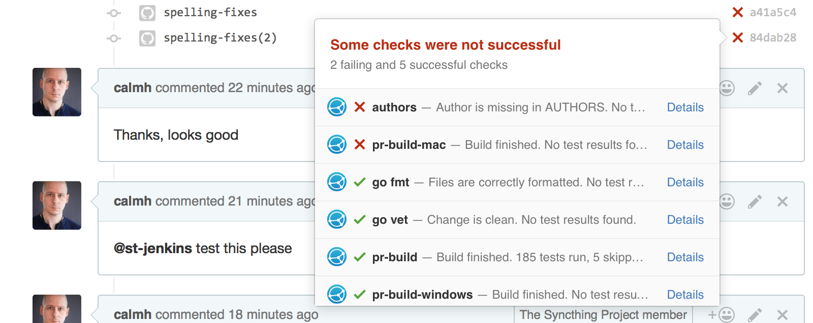
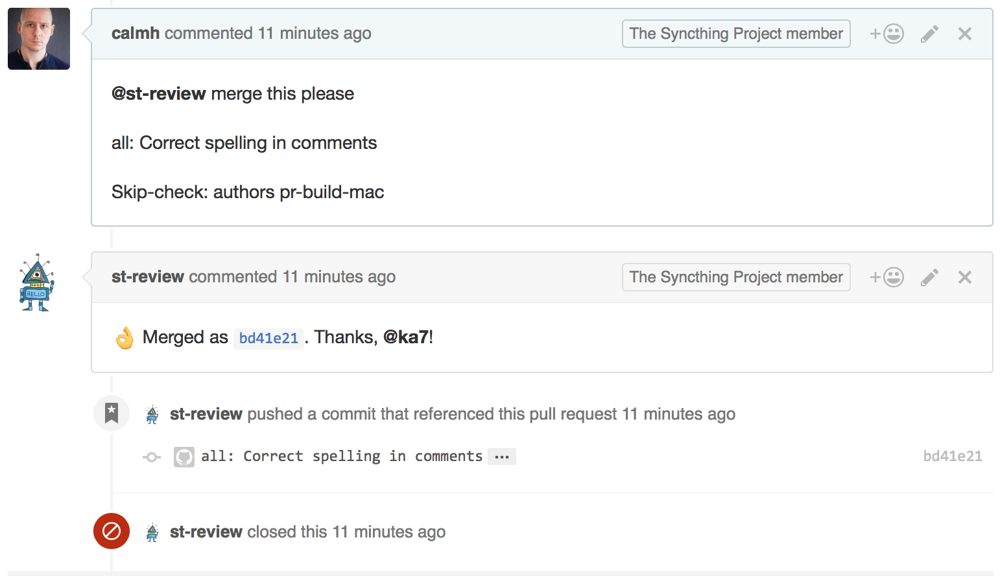

Interacting with the Merge Bot
==============================

There is a bot that hangs around on the Syncthing Github projects and
assists with doing correct merges of pull requests. Using the merge bot to
accept pull requests is the recommended way in all cases as it enforces some
extra checks that the "standard" Github merge button does not. The merge bot
is currently called ``st-review``.

Merging a PR
------------

There are two ways to merge a pull request - by direct ``merge`` command and by ``lgtm`` consensus.

By "lgtm"
~~~~~~~~~

Any developer with push access can evaluate the pull request and let the bot
know that they approve of it. The word for this is LGTM, "looks good to
me"::

    @st-review lgtm

The bot will record the fact that you think so by adding a ``LGTM: calmh``
footer to the commit message when it gets merged. The pull request is merged
once two developers have given their LGTM's.

The ``lgtm`` is hence a way to say "I think this is fine and should be
merged, but I'd appreciate a second look from someone else."

If the commit message or subject needs to be tweaked, used the ``merge``
command instead. A previously given ``lgtm`` will still be recorded on the
commit message.

By "merge"
~~~~~~~~~~

To merge a pull request, simply tell the bot to do so, making sure that the
first word of the command is ``merge``::

    @st-review merge

It's also possible to override the resulting commit subject and message when
doing this. Just add a blank line, the commit subject, another blank line,
and then the commit body (which can be empty). Don't worry about the text
formatting - the commit body will be reflowed appropriately by the bot::

    @st-review merge

    lib/dialer: Add env var to disable proxy fallback (fixes #3006)

Handling Check Results
----------------------

The merge bot will wait for status checks to resolve, but will refuse to
merge pull requests with unclean statuses:

It is possible to override this in cases where it's necessary, by adding a
``Skip-check`` command to the commit message body. Note that this must be in
the commit message *body*, which means that you need to supply both a commit
message subject and body. Don't overuse this -- it's better to ask Jenkins
to retest if something spurious happened. It can be used to allow merge of
commits from unregistered authors that only touches comments, for example.

The tag must be exactly ``Skip-check:`` followed by a *space separated* list
of check "contexts" as seen in the list on Github. I.e., to skip these two
checks:

Use the following syntax::

    @st-review merge this please

    all: Correct spelling in comments

    Skip-check: authors pr-build-mac

Please note that the exact string ``Skip-check: authors`` is magic in that
it also allows the build to pass, when it would otherwise stop with commits
from unknown authors.

.. note::

        If you want to skip the author check, make sure it's mentioned first
        and that the string is *exactly* "Skip-check: authors".
