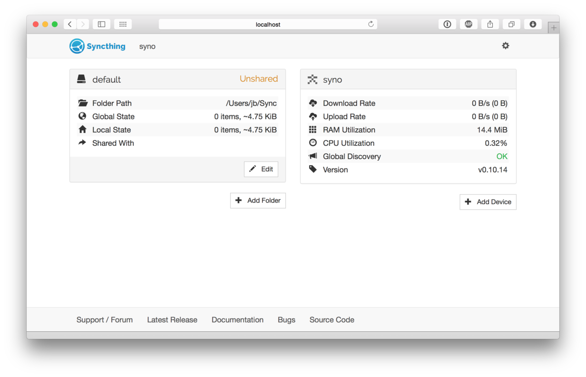
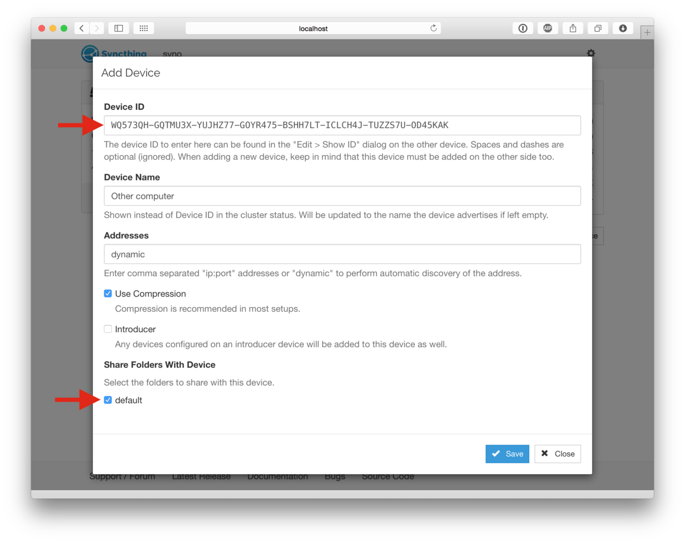
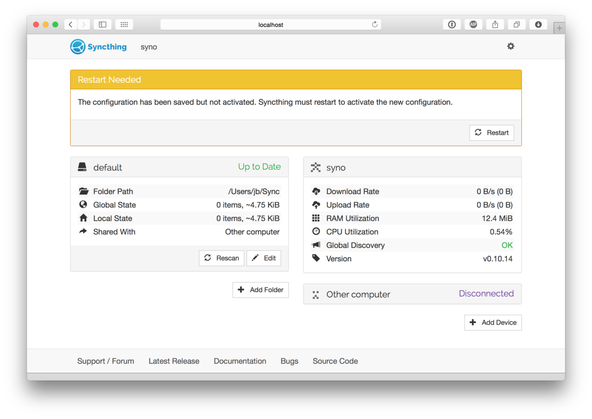
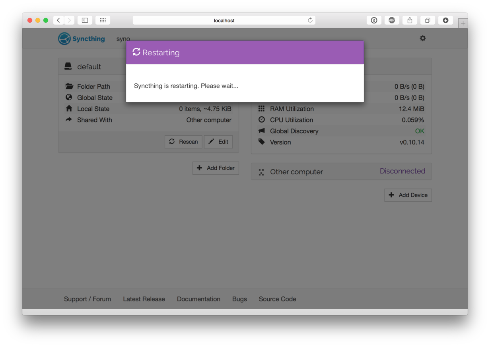
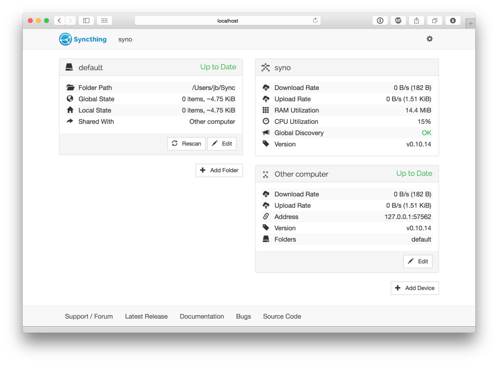

.. _getting-started:

Getting Started
===============

For this guide let's assume you have two machines between which you want
to synchronise files. In keeping with Syncthing terminology they are
going to be called "devices" in the rest of the documentation. The
"local device" is the one you are configuring, viewing status for, etc,
while the "remote device" is the other machine.

The best way to follow this guide is to do the install on both machines
and configure them in parallel. If both machines aren't accessible
simultaneously that's fine, the results will just be a little less
immediately obvious.

A film version of this transcript is available on YouTube (contributed by
@theincogtion). `This video <https://www.youtube.com/watch?v=foTxCfhxVLE>`__
shows how to install Syncthing on Ubuntu/Debian/Mint using PPA, also available
in `German <https://www.youtube.com/watch?v=Gh5nUlDzqJc>`__. `This video
<https://www.youtube.com/watch?v=2QcO8ikxzxA>`__ shows how to install Syncthing
on Windows, also available in `German
<https://www.youtube.com/watch?v=7LziT3KDiMU>`__

Installing
----------

We suggest you have a look to many of the :ref:`contributions` which let
you pick a flavor of Syncthing that best fits your scenario. For example, if you
are interested in a cross-platform GUI application you can check out
`Syncthing-GTK`_. The community has also developed Windows, Android and many
more specific flavors that help you run Syncthing on your devices. Currently
all community flavors run the same Syncthing core underneath, so don't worry
about changing your flavor at a later point in time. The remainder of this page
will explain how to set up two devices with the core Syncthing flavor.

.. _`Syncthing-GTK`: https://github.com/syncthing/syncthing-gtk

Syncthing
~~~~~~~~~

Grab the `latest release`_ of Syncthing for your operating system at and unpack
it. There will be a binary called ``syncthing`` (or ``syncthing.exe`` on
Windows). Start this in whatever way you are most comfortable with;
double-clicking should work in any graphical environment, but I'll use the
terminal to better illustrate what happens. At first start, Syncthing will
generate a configuration and some keys and then start the admin GUI in your
browser. Something like the following will be printed in the terminal::

    $ syncthing
    [monitor] 15:56:58 INFO: Starting syncthing
    15:56:58 INFO: Generating RSA key and certificate for syncthing...
    [ANSMX] 15:57:05 INFO: syncthing v0.10.14 (go1.4 darwin-amd64 default) jb@syno...
    [ANSMX] 15:57:05 INFO: My ID: ANSMXYD-E6CF3JC-TCVPYGF-GXJPHSJ-MKUXBUQ-ZSPOKXH-...
    [ANSMX] 15:57:05 INFO: No config file; starting with empty defaults
    [ANSMX] 15:57:05 INFO: Edit gs1/config.xml to taste or use the GUI
    [ANSMX] 15:57:05 INFO: Starting web GUI on http://127.0.0.1:8384/
    [ANSMX] 15:57:05 INFO: Loading HTTPS certificate: open gs1/https-cert.pem: no ...
    [ANSMX] 15:57:05 INFO: Creating new HTTPS certificate
    [ANSMX] 15:57:05 INFO: Generating RSA key and certificate for syno...
    [ANSMX] 15:57:07 INFO: Starting UPnP discovery...
    [ANSMX] 15:57:13 INFO: UPnP discovery complete (found 0 devices).
    [ANSMX] 15:57:13 INFO: Starting local discovery announcements
    [ANSMX] 15:57:13 INFO: Local discovery over IPv4 unavailable
    [ANSMX] 15:57:13 INFO: Starting global discovery announcements
    [ANSMX] 15:57:13 OK: Ready to synchronize default (read-write)
    [ANSMX] 15:57:13 INFO: Device ANSMXYD-E6CF3JC-TCVPYGF-GXJPHSJ-MKUXBUQ-ZSPOKXH-...
    [ANSMX] 15:57:13 INFO: Completed initial scan (rw) of folder default

At this point Syncthing will also have set up a folder called
``default`` for you, in a directory called ``Sync`` in your home
directory. You can use this as a starting point, then remove it or add
more folders later.

.. _`latest release`: https://github.com/syncthing/syncthing/releases/latest

Configuring
-----------

The admin GUI starts automatically and remains available on
``http://localhost:8384/``. It should look something like this:

On the left is the list of "folders", or directories to synchronize. You
can see the ``default`` folder was created for you, and it's currently
marked "Unshared" since it's not yet shared with any other device. On
the right is the list of devices. Currently there is only one device:
the computer you are running this on.

For Syncthing to be able to synchronize files with another device, it
must be told about that device. This is accomplished by exchanging
"device IDs". A device ID is a unique, cryptographically-secure
identifier that is generated as part of the key generation the first
time you start Syncthing. It is printed in the log above, and you can
see it in the web GUI by selecting the "gear menu" (top right) and "Show
ID".

Two devices will *only* connect and talk to each other if they both know
about the other's device ID. Since the configuration must be mutual for
a connection to happen, device IDs don't need to be kept secret.

To get your two devices to talk to each other, click "Add Device" at the
bottom right on both, and enter the device ID of the other side. You
should also select the folder(s) that you want to share with this
device. The device name is optional, but you can set it to something
that makes sense for you to remember what device this is.

Once you click "Save" the new device will appear on right side of the
GUI (although disconnected) and a prompt will be shown to indicate the
need for a restart.

Syncthing needs to be restarted for some configuration changes to take
effect (such as sharing folders with new devices). When you click
"Restart" Syncthing will first restart:

and then come back up and after a while (up to a minute) connect to the
other device. Remember though that you need to do the above process on
both devices, and only once you've done this on both devices will they
be able to connect.

At this point the two devices share an empty directory. Adding files to
the Sync directory on either device will synchronize those files to the
other side. Each device scans for changes every 60 seconds, so changes
can take a little over a minute to propagate to the other side. The
rescan interval can be changed for each folder by clicking on a folder,
clicking "Edit" and entering a new value for "Rescan Interval".

--------------

Good luck and have fun! There is more
`documentation <http://docs.syncthing.net/>`__ and if you run into
trouble feel free to post a question in the `support
forum <http://forum.syncthing.net/category/support>`__. If you have
problems getting this to connect, first take a look at :ref:`firewall-setup`, then
look at any error messages in the GUI or on the console and if necessary
move on to :ref:`debugging`.
