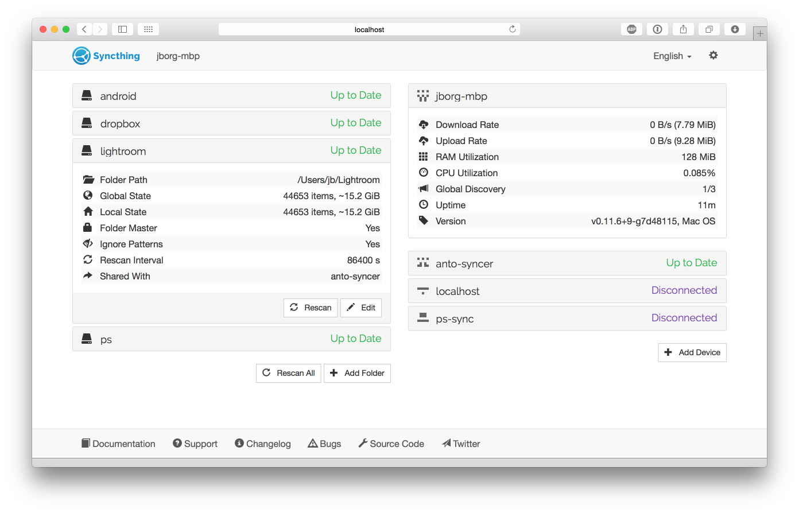

An intro to the GUI
===================

Folder View
-----------

The left side of the screen shows the ID and current state of all configured
folders. Clicking the folder name makes that section expand to show more
detailed folder information, and buttons for editing the configuration or
forcing a rescan.

A folder can be in any one of these states:

 - *Unknown* while the GUI is loading.

 - *Unshared* when you have not shared this folder,

 - *Stopped* when the folder has experienced an error,

 - *Scanning* while the folder is looking for local changes,

 - *Up to Date* when the folder is in sync with the rest of the cluster,

 - *Syncing* when this device is downloading changes from the network.

Among the folder details, you can see the current "Global State" and "Local State" summaries, as well as the amount of "Out of Sync" data if the the folder state is not up to date.

 - *Global State* indicates how much data the fully up to date folder contains - this is basically the sum of the newest versions of all files from all connected devices. This is the size of the folder on your computer when it is fully in sync with the cluster.

 - *Local State* shows how much data the folder actually contains right now. This can be more or less than the global state, if the folder is currently synchronizing with other devices.

 - *Out of Sync* shows how much data that needs to be synchronized from other devices. Note that this is the sum of all out of sync *files* - if you already have parts of such a file, or an older version of the file, less data than this will need to be transferred over the network.

Device View
-----------

The right side of the screen shows the overall state of all configured
devices. The local device (your computer) is always at the top, with remote
devices in alphabetical order below. For each device you see its current state
and, when expanded, more detailed information. All transfer rates ("Download
Rate" and "Upload Rate") are from the perspective of your computer, even those
shown for remote devices. The rates for your local device is the sum of those
for the remote devices.
