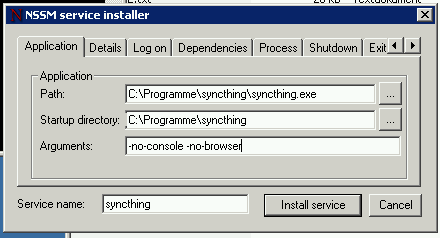
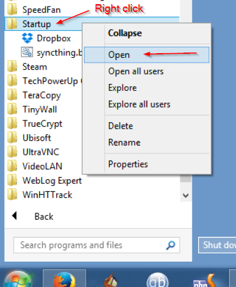

Starting Syncthing Automatically
================================

.. warning::
  This page may be outdated and requires review.

Windows
-------

There is currently no official installer available for Windows. However,
there are a number of easy solutions.

Third-party Tools
~~~~~~~~~~~~~~~~~

There are a number of third-party utilities which aim to address this
issue. These typically provide an installer, let Syncthing start
automatically, and a more polished user experience (e.g. by behaving as
a "proper" Windows application, rather than forcing you to start your
browser to interact with Syncthing).

.. seealso:: :ref:`Windows GUI Wrappers <contrib-windows>`, :ref:`Cross-platform GUI Wrappers <contrib-all>`.

Start on Login
~~~~~~~~~~~~~~

Starting Syncthing on login, without a console window or browser opening
on start, is relatively easy.

#. Find the correct link of the Windows binary from the `Syncthing
   website <https://github.com/syncthing/syncthing/releases>`__ (choose
   **amd64** if you have a 64-bit version of Windows)
#. Extract the files in the folder (``syncthing-windows-*``) in the zip
   to the folder ``C:\syncthing``
#. Go to the ``C:\syncthing`` folder, make a file named
   ``syncthing.bat``
#. Right-click the file and choose **Edit**. The file should open in
   Notepad or your default text editor.
#. Paste the following command into the file and save the changes:
   ``start "Syncthing" syncthing.exe -no-console -no-browser``
#. Right-click on ``syncthing.bat`` and press "Create Shortcut"
#. Right-click the shortcut file ``syncthing.bat - Shortcut`` and click
   **Copy**
#. Click **Start**, click **All Programs**, then click **Startup**.
   Right-click on **Startup** then click **Open**.
   |Setup Screenshot|
#. Paste the shortcut (right-click in the folder and choose **Paste**,
   or press ``CTRL+V``)

Syncthing will now automatically start the next time Windows boots. No
console or browser window will pop-up. Access the interface by browsing
to http://localhost:8384/

If you prefer slower indexing but a more responsive system during scans,
copy the following command instead of the command in step 5::

    start "Syncthing" /low syncthing.exe -no-console -no-browser

Run independent of user login
~~~~~~~~~~~~~~~~~~~~~~~~~~~~~

.. warning::
  There are important security considerations with this approach. If you do not
  secure Syncthing's GUI (and REST API), then **any** process running with
  **any** permissions can read/write **any** file on your filesystem, by opening
  a connection with Syncthing.

  Therefore, you **must** ensure that you set a GUI password, or run Syncthing
  as an unprivileged user.

With the above configuration, Syncthing only starts when a user logs in
onto the machine. This is not optimal on servers, where a machine can
run long times after a reboot without anyone logged in. In this case, it
is best to create a service that runs as soon as Windows starts. This
can be achieved using nssm.

Note that starting Syncthing on login is the preferred approach for
almost any end-user scenario. The only scenario where running Syncthing
as a service makes sense is for (mostly) headless servers, administered
by a sysadmin who knows enough to understand the security implications.

#. Download and extract `nssm <http://nssm.cc/download>`__ to a folder
   where it can stay (e.g. *c:Files* or the Syncthing folder.
#. run *nssm.exe install syncthing*
#. Select ``syncthing.exe`` in the first tab and enter
   ``-no-console -no-browser`` as Arguments
   |Configuration Screenshot|
#. at the Details tab you can switch to *Automatic (Delayed Start)* to
   start it only some time after boot and speed up the boot process
   (optional)
#. At the *Log On* tab you can enter a username and password for the
   user to run Syncthing as. This user needs to have access to all the
   synced folders. Usually, you can leave it as the System account.
#. At the Process Tab you can change the priority to low if you want a
   more responsive system at the cost of longer sync time
#. Click the *Install Service* Button
#. Start the service using the windows service manager, enter
   ``sc start syncthing`` in a console window or restart the PC.
#. Connect to the Syncthing UI, enable HTTPS, and set a secure username
   and password.

Mac OS X
--------

Using `homebrew <http://brew.sh>`__
~~~~~~~~~~~~~~~~~~~~~~~~~~~~~~~~~~~

#. ``brew install syncthing``
#. Follow the info to autostart Syncthing using launchctl. At the moment
   this is done using this command:
   ``launchctl load ~/Library/LaunchAgents/homebrew.mxcl.syncthing.plist``.

Without homebrew
~~~~~~~~~~~~~~~~

Download Syncthing for Mac:
https://github.com/syncthing/syncthing/releases/latest.

#. Copy the syncthing binary (the file you would open to launch
   Syncthing) in a directory called ``bin`` in your home directory. If
   "bin" does not exist, create it.
#. Edit the ``syncthing.plist`` (located in /etc/macosx-launchd) in the
   two places that refer to your home directory; that is, replace
   /Users/jb with your actual home directory location.
#. Copy the ``syncthing.plist`` file to ``~/Library/LaunchAgents``. If
   you have trouble finding this location select the "Go" menu in Finder
   and choose "Go to folder..." and then type
   ``~/Library/LaunchAgents``. Copying to ~/Library/LaunchAgents will
   require admin password in most cases.
#. Log out and back in again. Or, if you do not want to log out, you can
   run this command in terminal:
   ``launchctl load ~/Library/LaunchAgents/syncthing.plist``

**Note:** You probably want to turn off "Start Browser" in the web GUI
settings to avoid it opening a browser window on each login. Then, to
access the GUI type 127.0.0.1:8384 (by default) into Safari.

Linux
-----

Ubuntu like systems
~~~~~~~~~~~~~~~~~~~

#. Click the dashboard (hit 'Win' button).
#. Open 'Startup Applications'.
#. Click 'Add'.
#. Fill out the form:

   -  Name: Syncthing
   -  ``Command: /path/to/syncthing/binary -no-browser -home="/home/your\_user/.config/syncthing"``

Supervisord
~~~~~~~~~~~

Add following to your ``/etc/supervisord.conf``::

    [program:syncthing]
    command = /path/to/syncthing/binary -no-browser -home="/home/some_user/.config/syncthing"
    directory = /home/some_user/
    autorestart = True
    user = some_user
    environment = STNORESTART="1"

systemd
~~~~~~~

systemd is a suite of system management daemons, libraries, and
utilities designed as a central management and configuration platform
for the Linux computer operating system. It also offers users the
ability to manage services under the user's control with a per-user
systemd instance, enabling users to start, stop, enable, and disable
their own units. Service files for system are provided by Syncthing and
can be found in
`etc/linux-systemd <https://github.com/syncthing/syncthing/tree/master/etc/linux-systemd>`_.
Several distros (including arch linux) ship these service files with the
Syncthing package. If your distro provides a systemd service file for
Syncthing you can skip step 2.

How to use the system instance
^^^^^^^^^^^^^^^^^^^^^^^^^^^^^^

Running Syncthing as a system service ensures that Syncthing is run at startup
even if the Syncthing user has no active session. Since the system service
keeps Syncthing running even without an active user session, it is intended to
be used on a *server*.

#. Create the user who should run the service, or choose an existing
   one.
#. Copy the ``system/syncthing@.service`` file into the `load path of
   the system
   instance <http://www.freedesktop.org/software/systemd/man/systemd.unit.html#Unit%20Load%20Path>`__.
#. Enable and start the service. Append the Syncthing user after the
   ``@``::

    systemctl enable syncthing@myuser.service
    systemctl start syncthing@myuser.service

How to use the user instance
^^^^^^^^^^^^^^^^^^^^^^^^^^^^

Running Syncthing as a user service ensures that Syncthing is run after the
Syncthing user has created a session (e.g. via the graphical login screen or
ssh). Thus, the user service is intended to be used on a *(multiuser) desktop
computer*. It avoids unnecessarily running Syncthing instances.

#. Create the user who should run the service, or choose an existing
   one.
#. Copy the ``user/syncthing.service`` file into the `load path of the
   user
   instance <http://www.freedesktop.org/software/systemd/man/systemd.unit.html#Unit%20Load%20Path>`__.
   To do this without root privileges you can use
   ``~/.config/systemd/user/``.
#. Enable and start the service::

    systemctl --user enable syncthing.service
    systemctl --user start syncthing.service

To check if Syncthing runs properly you can use the ``status``
subcommand::

    systemctl status syncthing@myuser.service
    systemctl --user status syncthing.service

Using the journal
^^^^^^^^^^^^^^^^^

Systemd logs everything into the journal. You can easily access Syncthing
log messages (``-e`` lets the pager jump to the very end)::

    journalctl -e -u syncthing@myuser.service
    journalctl -e --user-unit=syncthing.service
    
Permissions
^^^^^^^^^

In case you want to override the permissions under which the files and folders are created (especially because Windows does not have a concept of group permissions), you enable the `Ignore Permissions` option in the folder settings, and add the line "UMask=0002" (or any other umask you like) in the [Service] section of the "syncthing@.service" file.

Debugging
^^^^^^^^^

If you are asked on the bugtracker to start Syncthing with specific
environment variables it will not work the easy way. Systemd isolates each
service and it cannot access global environment variables. The solution is to
add this variables to the service file instead. Just use::

    systemctl edit syncthing@myuser.service
    systemctl --user edit syncthing.service

This will create an additional configuration file automatically and you
can define (or overwrite) further service parameters like e.g.
``Environment=STTRACE=model``.

