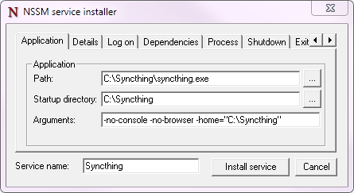

Starting Syncthing Automatically
================================

.. warning::
  This page may be outdated and requires review.

Windows
-------

There is currently no official installer available for Windows. However,
there are a number of easy solutions.

Task Scheduler
~~~~~~~~~~~~~~

#. Start the `Task Scheduler <https://en.wikipedia.org/wiki/Windows_Task_Scheduler>`__
#. Create a New Task ("Action" menu -> "Create Task...")
#. General Tab:
    #. Name the task (for example 'Syncthing')
    #. Check "Run whether user is logged on or not"
#. Triggers Tab:
    #. Click "New..."
    #. Set "Begin the task" to "At Startup"
    #. (optional) choose a delay
    #. Make sure Enabled is checked
    #. Click "OK"
#. Actions Tab:
    #. Click "New..."
    #. [Action] should be set as "Start a program"
    #. Enter the path to syncthing.exe in "Program/Script"
    #. (optional) Enter "-no-console -no-browser" for "Add arguments (optional)"
    #. Click "OK"
#. Settings Tab:
    #. (recommended) Keep the checkbox on "Allow task to be run on demand"
    #. Clear checkbox from "Stop task if it runs longer than:"
    #. (recommended) Keep "Do not start a new instance" for "If the task is already running, then the following rule applies"
#. Click OK
#. Enter password for the user.

Third-party Tools
~~~~~~~~~~~~~~~~~

There are a number of third-party utilities which aim to address this
issue. These typically provide an installer, let Syncthing start
automatically, and a more polished user experience (e.g. by behaving as
a "proper" Windows application, rather than forcing you to start your
browser to interact with Syncthing).

.. seealso:: :ref:`Windows GUI Wrappers <contrib-windows>`, :ref:`Cross-platform GUI Wrappers <contrib-all>`.

Start on Login
~~~~~~~~~~~~~~

Starting Syncthing on login, without a console window or browser opening
on start, is relatively easy.

#. Find the correct link of the Windows binary from the `Syncthing
   website <https://github.com/syncthing/syncthing/releases>`__ (choose
   **amd64** if you have a 64-bit version of Windows)
#. Extract the files in the folder (``syncthing-windows-*``) in the zip
   to the folder ``C:\syncthing``
#. Go to the ``C:\syncthing`` folder, make a file named
   ``syncthing.bat``
#. Right-click the file and choose **Edit**. The file should open in
   Notepad or your default text editor.
#. Paste the following command into the file and save the changes:
   ``start "Syncthing" syncthing.exe -no-console -no-browser``
#. Right-click on ``syncthing.bat`` and press "Create Shortcut"
#. Right-click the shortcut file ``syncthing.bat - Shortcut`` and click
   **Copy**
#. Click **Start**, click **All Programs**, then click **Startup**.
   Right-click on **Startup** then click **Open**.
   |Setup Screenshot|
#. Paste the shortcut (right-click in the folder and choose **Paste**,
   or press ``CTRL+V``)

Syncthing will now automatically start the next time you open a new Windows session. No
console or browser window will pop-up. Access the interface by browsing
to http://localhost:8384/

If you prefer slower indexing but a more responsive system during scans,
copy the following command instead of the command in step 5::

    start "Syncthing" /low syncthing.exe -no-console -no-browser

Run as a service independent of user login
~~~~~~~~~~~~~~~~~~~~~~~~~~~~~~~~~~~~~~~~~~

.. warning::
  There are important security considerations with this approach. If you do not
  secure Syncthing's GUI (and REST API), then **any** process running with
  **any** permissions can read/write **any** file on your filesystem, by opening
  a connection with Syncthing.

  Therefore, you **must** ensure that you set a GUI password, or run Syncthing
  as an unprivileged user.

With the above configuration, Syncthing only starts when a user logs on to the machine. This is not optimal on servers where a machine can
run long times after a reboot without anyone logged in. In this case it
is best to create a service that runs as soon as Windows starts. This
can be achieved using NSSM, the "Non-Sucking Service Manager".

Note that starting Syncthing on login is the preferred approach for
almost any end-user scenario. The only scenario where running Syncthing
as a service makes sense is for (mostly) headless servers, administered
by a sysadmin who knows enough to understand the security implications.

#. Download and extract `nssm <http://nssm.cc/download>`__ to a folder where it can stay. The NSSM executable performs administration as well as executing as the Windows service so it will need to be kept in a suitable location.
#. From an administrator Command Prompt, CD to the NSSM folder and run ``nssm.exe install syncthing``
#. Application Tab

   -  Set *Path* to your ``syncthing.exe`` and enter ``-no-restart -no-browser -home="<path to your Syncthing folder>"`` as Arguments. Note: Logging is set later on. ``-logfile`` here will not be applied.
   -  |Windows NSSM Configuration Screenshot|
#. Details Tab

   -  Optional: Set *Startup type* to *Automatic (Delayed Start)* to delay the start of Syncthing when the system first boots, to improve boot speed.
#. Log On Tab

   -  Enter the user account to run Syncthing as. This user needs to have access to all the synced folders. You can leave this as *Local System* but doing so poses security risks. Setting this to your Windows user account will reduce this; ideally create a dedicated user account with minimal permissions.
#. Process Tab

   -  Optional: Change priority to *Low* if you want a more responsive system at the cost of somewhat longer sync time when the system is busy.
   -  Optional: To enable logging enable "Console window".
#. Shutdown Tab

   -  To ensure Syncthing is shut down gracefully select all of the checkboxes and set all *Timeouts* to *10000ms*.
#. Exit Actions Tab

   -  Set *Restart Action* to *Stop service (oneshot mode)*. Specific settings are used later for handling Syncthing exits, restarts and upgrades.
#. I/O Tab

   -  Optional: To enable logging set *Output (stdout)* to the file desired for logging. The *Error* field will be automatically set to the same file.
#. File Rotation Tab

   -  Optional: Set the rotation settings to your preferences.
#. Click the *Install Service* Button
#. To ensure that Syncthing exits, restarts and upgrades are handled correctly by the Windows service manager, some final settings are needed. Execute these in the same Commant Prompt:

   -  ``nssm set syncthing AppExit Default Exit``
   -  ``nssm set syncthing AppExit 0 Exit``
   -  ``nssm set syncthing AppExit 3 Restart``
   -  ``nssm set syncthing AppExit 4 Restart``
#. Start the service via ``sc start syncthing`` in the Command Prompt.
#. Connect to the Syncthing UI, enable HTTPS, and set a secure username and password.

Mac OS X
--------

Using `homebrew <http://brew.sh>`__
~~~~~~~~~~~~~~~~~~~~~~~~~~~~~~~~~~~

#. ``brew install syncthing``
#. Follow the information presented by ``brew`` to autostart Syncthing using launchctl.

Without homebrew
~~~~~~~~~~~~~~~~

Download and extract Syncthing for Mac:
https://github.com/syncthing/syncthing/releases/latest.

#. Copy the syncthing binary (the file you would open to launch
   Syncthing) into a directory called ``bin`` in your home directory i.e. into /home/<username>/bin. If
   "bin" does not exist, create it.
#. Open ``syncthing.plist`` located in /etc/macosx-launchd. Replace the four occurrences of /Users/USERNAME with your actual home directory location.
#. Copy the ``syncthing.plist`` file to ``~/Library/LaunchAgents``. If
   you have trouble finding this location select the "Go" menu in Finder
   and choose "Go to folder..." and then type
   ``~/Library/LaunchAgents``. Copying to ~/Library/LaunchAgents will
   require admin password in most cases.
#. Log out and back in again. Or, if you do not want to log out, you can
   run this command in terminal:
   ``launchctl load ~/Library/LaunchAgents/syncthing.plist``

**Note:** You probably want to turn off "Start Browser" in the web GUI
settings to avoid it opening a browser window on each login. Then, to
access the GUI type 127.0.0.1:8384 (by default) into Safari.

Linux
-----

On Ubuntu-like systems
~~~~~~~~~~~~~~~~~~~~~~

#. Launch the program 'Startup Applications'.
#. Click 'Add'.
#. Fill out the form:

   -  Name: Syncthing
   -  Command: ``/path/to/syncthing/binary -no-browser -home="/home/your\_user/.config/syncthing"``

Using Supervisord
~~~~~~~~~~~~~~~~~

Add the following to your ``/etc/supervisord.conf`` file::

    [program:syncthing]
    command = /path/to/syncthing/binary -no-browser -home="/home/some_user/.config/syncthing"
    directory = /home/some_user/
    autorestart = True
    user = some_user
    environment = STNORESTART="1", HOME="/home/some_user"

Using systemd
~~~~~~~~~~~~~

systemd is a suite of system management daemons, libraries, and
utilities designed as a central management and configuration platform
for the Linux computer operating system. It also offers users the
ability to manage services under the user's control with a per-user
systemd instance, enabling users to start, stop, enable, and disable
their own units. Service files for systemd are provided by Syncthing and
can be found in
`etc/linux-systemd <https://github.com/syncthing/syncthing/tree/master/etc/linux-systemd>`_.

You have two primary options: You can set up Syncthing as a system service, or a
user service.

Running Syncthing as a system service ensures that Syncthing is run at startup
even if the Syncthing user has no active session. Since the system service keeps
Syncthing running even without an active user session, it is intended to be used
on a *server*.

Running Syncthing as a user service ensures that Syncthing only starts after the
user has logged into the system (e.g., via the graphical login screen, or ssh).
Thus, the user service is intended to be used on a *(multiuser) desktop
computer*. It avoids unnecessarily running Syncthing instances.

Several distros (including arch linux) ship the needed service files with the
Syncthing package. If your distro provides a systemd service file for Syncthing,
you can skip step 2 when you setting up either the system service or the user
service, as described below.

How to set up a system service
^^^^^^^^^^^^^^^^^^^^^^^^^^^^^^

#. Create the user who should run the service, or choose an existing one.
#. Copy the ``Syncthing/etc/system/syncthing@.service`` file into the
   `load path of the system instance
   <http://www.freedesktop.org/software/systemd/man/systemd.unit.html#Unit%20Load%20Path>`__.
#. Enable and start the service. Replace "myuser" with the actual Syncthing
   user after the ``@``::

    systemctl enable syncthing@myuser.service
    systemctl start syncthing@myuser.service

How to set up a user service
^^^^^^^^^^^^^^^^^^^^^^^^^^^^

#. Create the user who should run the service, or choose an existing
   one. *Probably this will be your own user account.*
#. Copy the ``Syncthing/etc/user/syncthing.service`` file into the `load path
   of the user instance
   <http://www.freedesktop.org/software/systemd/man/systemd.unit.html#Unit%20Load%20Path>`__.
   To do this without root privileges you can just use this folder under your
   home directory: ``~/.config/systemd/user/``.
#. Enable and start the service::

    systemctl --user enable syncthing.service
    systemctl --user start syncthing.service

Checking the service status
^^^^^^^^^^^^^^^^^^^^^^^^^^^

To check if Syncthing runs properly you can use the ``status``
subcommand. To check the status of a system service::

    systemctl status syncthing@myuser.service

To check the status of a user service::

    systemctl --user status syncthing.service

Using the journal
^^^^^^^^^^^^^^^^^

Systemd logs everything into the journal, so you can easily access Syncthing log
messages. In both of the following examples, ``-e`` tells the pager to jump to
the very end, so that you see the most recent logs.

To see the logs for the system service::

    journalctl -e -u syncthing@myuser.service

To see the logs for the user service::

    journalctl -e --user-unit=syncthing.service

Permissions
^^^^^^^^^^^

If you enabled the ``Ignore Permissions`` option in the Syncthing client's
folder settings, then you will also need to add the line ``UMask=0002`` (or any
other `umask setting <http://www.tech-faq.com/umask.html>` you like) in the
``[Service]`` section of the ``syncthing@.service`` file.

Debugging
^^^^^^^^^

If you are asked on the bugtracker to start Syncthing with specific
environment variables it will not work the normal way. Systemd isolates each
service and it cannot access global environment variables. The solution is to
add the variables to the service file instead.

To edit the system service, run::

    systemctl edit syncthing@myuser.service

To edit the user service, run::

    systemctl --user edit syncthing.service

This will create an additional configuration file automatically and you
can define (or overwrite) further service parameters like e.g.
``Environment=STTRACE=model``.

.. |Setup Screenshot| image:: st2.png
