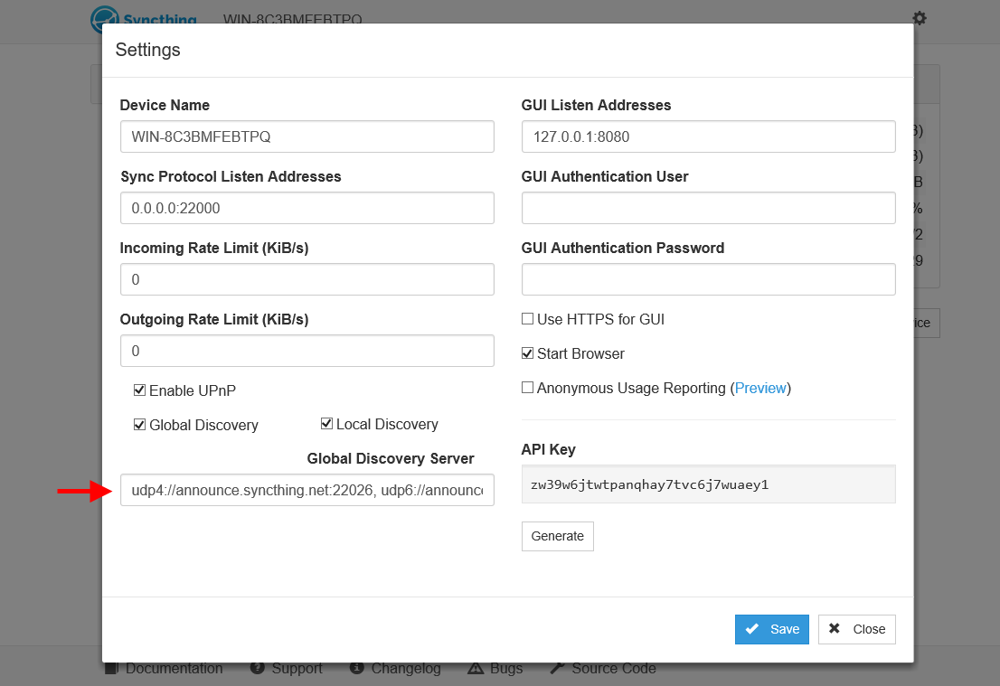

Running a Discovery Server
==========================

Description
-----------

This guide assumes that you have already set up Syncthing. If you
haven't yet, head over to :ref:`getting-started` first.

Installing
----------

Go to `releases <https://github.com/syncthing/discosrv/releases>`__ and
download the file appropriate for your operating system. Unpacking it will
yield a binary called ``discosrv`` (or ``discosrv.exe`` on Windows). Start
this in whatever way you are most comfortable with; double clicking should
work in any graphical environment. At first start, discosrv will generate the
directory ``/var/discosrv`` (``X:\var\discosrv`` on Windows, where X is the
partition ``discosrv.exe`` is executed from) with configuration. If the user
running ``discosrv`` doesn't have permission to do so, create the directory
and set the owner appropriately or use the command line switches (see below)
to select a different location.

Pointing Syncthing at Your Discovery Server
-------------------------------------------

By default, Syncthing uses the global discovery servers at
``announce.syncthing.net`` (IPv4) and ``announce-v6.syncthing.net`` (IPv6). To
make Syncthing use your own instance of discosrv, open up Syncthing's web GUI.
Go to settings, Global Discovery Server and add discosrv's host address to the
comma-separated list, e.g. ``udp4://server_address_or_ip.tld:port_number``.
Note that discosrv uses port 22026 by default. For discosrv to be available
over the internet with a dynamic ip address, you will need a dynamic DNS
service.

|Settings Screenshot|

Configuring
-----------

Running discosrv with non-default settings requires passing the
respective parameters to discosrv on every start. ``discosrv -help``
gives you all the tweakables with their defaults:

::

    -db-dir="/var/discosrv/db": Database directory
    -debug=false: Enable debug output
    -limit-avg=1: Allowed average package rate, per 10 s
    -limit-burst=10: Allowed burst size, packets
    -limit-cache=1024: Limiter cache entries
    -listen=":22026": Listen address
    -stats-file="/var/discosrv/stats": Statistics file name
    -stats-intv=0: Statistics output interval (s)
    -timestamp=true: Timestamp the log output
    -unknown-file="": Unknown packet log file name

Linux
~~~~~

The following instructions enables a ``discosrv`` instance on a Ubuntu server,
and assumes the user has knowledge of basic linux commands.

- Copy the discosrv executable to /usr/local/bin and set permissions
  as follows: user root, group root, permissions 0755

- Using putty, login to your VPS and enter the following commands::

  $ cd /usr/local/bin
  $ sudo discosrv -listen=":22026"

- Leave 1st terminal open and open a second putty terminal, login to
  the VPS and execute::

  $ sudo netstat -ulp

  The output should indicate that discosrv is listening on port 22026.

- When you close the putty terminals, the installed discosrv will stop
  running. To enable an "always on" state, add nohup & to the terminal
  command. The correct command is::

  $ nohup sudo discosrv -listen=":22026" &

  Now when you close the terminal, discosrv will still be running.

- Set the Syncthing WebGUI settings for "Global Discovery Server" to
  point to ``udp4://your.vps.ip.address:22026`` and restart Syncthing.

Windows
~~~~~~~

On Windows, it is unusual to have a var folder in a root directory. The
following batch file will start ``discosrv`` from the current folder and make
``discosrv`` create and use the current folder for its config. You can easily
change all available parameters if desired.

::

    @ECHO OFF
    :: Database directory. Default is "X:\var\discosrv\db", where X is the partition discosrv.exe is executed on.
    SET db-dir=%CD%\db
    :: Statistics file name. Default is "X:\var\discosrv\stats", where X is the partition discosrv.exe is executed on - note that this is a text file without extension, not a directory.
    SET stats-file=%CD%\stats
    :: Listen address. Default is ":22026".
    SET listen=:22026

    :: These parameters usually don't need tampering. If you don't understand what they do, leave them alone.
    :: Enable debug output, true/false. Default is "false".
    SET debug=false
    :: Allowed average packet rate, per 10s. Default is "1".
    SET limit-avg=1
    :: Allowed burst size, packets. Default is "10".
    SET limit-burst=10
    :: Limiter cache entries. Default is "1024".
    SET limit-cache=1024
    :: Statistics output interval in seconds. Default is "0".
    SET stats-intv=0
    :: Enable timestamping the log output. Default is "true".
    SET timestamp=true
    :: Unknown packet log file name. Default is an empty string, "".
    SET unknown-file=
    ECHO ON

    START "discosrv" /B discosrv.exe -db-dir="%db-dir%" -stats-file="%stats-file%" -listen="%listen%" -debug=%debug% -limit-avg=%limit-avg% -limit-burst=%limit-burst% -limit-cache=%limit-cache% -stats-intv=%stats-intv% -timestamp=%timestamp% -unknown-file="%unknown-file%"

