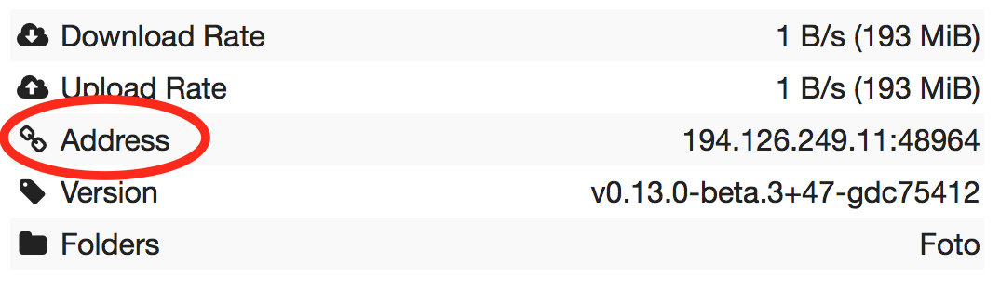

.. _faq:

FAQ
===

General
-------

What is Syncthing?
~~~~~~~~~~~~~~~~~~

Syncthing is an application that lets you synchronize your files across multiple
devices. This means the creation, modification or deletion of files on one
machine will automatically be replicated to your other devices. We believe your
data is your data alone and you deserve to choose where it is stored. Therefore
Syncthing does not upload your data to the cloud but exchanges your data across
your machines as soon as they are online at the same time.

Is it "syncthing", "Syncthing" or "SyncThing"?
~~~~~~~~~~~~~~~~~~~~~~~~~~~~~~~~~~~~~~~~~~~~~~

It's **Syncthing**, although the command and source repository is spelled
``syncthing`` so it may be referred to in that way as well. It's definitely not
:strike:`SyncThing`, even though the abbreviation ``st`` is used in some
circumstances and file names.

How does Syncthing differ from BitTorrent Sync?
~~~~~~~~~~~~~~~~~~~~~~~~~~~~~~~~~~~~~~~~~~~~~~~

The two are different and not related. Syncthing and BitTorrent Sync accomplish
some of the same things, namely syncing files between two or more computers.

BitTorrent Sync by BitTorrent, Inc is a proprietary peer-to-peer file
synchronization tool available for Windows, Mac, Linux, Android, iOS, Windows
Phone, Amazon Kindle Fire and BSD. [#btsync]_ Syncthing is an open source file
synchronization tool.

Syncthing uses an open and documented protocol, and likewise the security
mechanisms in use are well defined and visible in the source code. BitTorrent
Sync uses an undocumented, closed protocol with unknown security properties.

.. [#btsync] http://en.wikipedia.org/wiki/BitTorrent_Sync

Usage
-----

What things are synced?
~~~~~~~~~~~~~~~~~~~~~~~

The following things are *always* synchronized:

-  File Contents
-  File Modification Times

The following may be synchronized or not, depending:

-  File Permissions (When supported by file system. On Windows, only the
   read only bit is synchronized.)
-  Symbolic Links (When supported by the OS. On Windows Vista and up,
   requires administrator privileges. Links are synced as is and are not
   followed.)

The following is *not* synchronized;

-  File or Directory Owners and Groups (not preserved)
-  Directory Modification Times (not preserved)
-  Hard Links (followed, not preserved)
-  Extended Attributes, Resource Forks (not preserved)
-  Windows, POSIX or NFS ACLs (not preserved)
-  Devices, FIFOs, and Other Specials (ignored)
-  Sparse file sparseness (will become unsparse)

Is synchronization fast?
~~~~~~~~~~~~~~~~~~~~~~~~

Syncthing segments files into pieces, called blocks, to transfer data from one
device to another. Therefore, multiple devices can share the synchronization
load, in a similar way as the torrent protocol. The more devices you have online
(and synchronized), the faster an additional device will receive the data
because small blocks will be fetched from all devices in parallel.

Syncthing handles renaming files and updating their metadata in an efficient
manner. This means that renaming a large file will not cause a retransmission of
that file. Additionally, appending data to existing large files should be
handled efficiently as well.

Temporary files are used to store partial data downloaded from other devices.
They are automatically removed whenever a file transfer has been completed or
after the configured amount of time which is set in the configuration file (24
hours by default).

Why is the sync so slow?
~~~~~~~~~~~~~~~~~~~~~~~~

When troubleshooting a slow sync, there are a number of things to check.

First of all, verify that you are not connected via a relay. In the "Remote
Devices" list on the right side of the GUI, double check that you see
"Address: <some address>" and *not* "Relay: <some address>".

If you are connected via a relay, this is because a direct connection could
not be established. Double check and follow the suggestions in
:ref:`firewall-setup` to enable direct connections.

Second, if one of the devices is a very low powered machine (a Raspberry Pi,
or a phone, or a NAS, or similar) you are likely constrained by the CPU on
that device. See the next question for reasons Syncthing likes a faster CPU.
You can verify this by looking at the CPU utilization in the GUI. If it is
constantly at or close to 100%, you are limited by the CPU speed. In some
cases a lower CPU usage number can also indicate being limited by the CPU -
for example constant 25% usage on a four core CPU likely means that
Syncthing is doing something that is not parallellizable and thus limited to
a single CPU core.

Third, verify that the network connection is OK. Tools such as iperf or just
an Internet speed test can be used to verify the performance here.

Why does it use so much CPU?
~~~~~~~~~~~~~~~~~~~~~~~~~~~~

#. When new or changed files are detected, or Syncthing starts for the
   first time, your files are hashed using SHA-256.

#. Data that is sent over the network is (optionally) compressed and
   encrypted using AES-128. When receiving data, it must be decrypted.

#. There is a certain amount of housekeeping that must be done to track the
   current and available versions of each file in the index database.

#. By default Syncthing uses periodic scanning every 60 seconds to detect
   file changes. This means checking every file's modification time and
   comparing it to the database. This can cause spikes of CPU usage for large
   folders.

Hashing, compression and encryption cost CPU time. Also, using the GUI
causes a certain amount of extra CPU usage to calculate the summary data it
presents. Note however that once things are *in sync* CPU usage should be
negligible.

To limit the amount of CPU used when syncing and scanning, set the
environment variable ``GOMAXPROCS`` to the maximum number of CPU cores
Syncthing should use at any given moment. For example, ``GOMAXPROCS=2`` on a
machine with four cores will limit Syncthing to no more than half the
system's CPU power.

To reduce CPU spikes from scanning activity, use a filesystem notifications
plugin. This is delivered by default via Synctrayzor, Syncthing-GTK and on
Android. For other setups, consider using `syncthing-inotify
<https://github.com/syncthing/syncthing-inotify>`_.

Should I keep my device IDs secret?
~~~~~~~~~~~~~~~~~~~~~~~~~~~~~~~~~~~

No. The IDs are not sensitive. Given a device ID it's possible to find the IP
address for that node, if global discovery is enabled on it. Knowing the device
ID doesn't help you actually establish a connection to that node or get a list
of files, etc.

For a connection to be established, both nodes need to know about the other's
device ID. It's not possible (in practice) to forge a device ID. (To forge a
device ID you need to create a TLS certificate with that specific SHA-256 hash.
If you can do that, you can spoof any TLS certificate. The world is your
oyster!)

.. seealso::
    :ref:`device-ids`

What if there is a conflict?
~~~~~~~~~~~~~~~~~~~~~~~~~~~~

Syncthing does recognize conflicts. When a file has been modified on two devices
simultaneously, one of the files will be renamed to ``<filename>.sync-
conflict-<date>-<time>.<ext>``. The device which has the larger value of the
first 63 bits for his device ID will have his file marked as the conflicting
file. Note that we only create ``sync-conflict`` files when the actual content
differs.

Beware that the ``<filename>.sync-conflict-<date>-<time>.<ext>`` files are
treated as normal files after they are created, so they are propagated between
devices. We do this because the conflict is detected and resolved on one device,
creating the ``sync-conflict`` file, but it's just as much of a conflict
everywhere else and we don't know which of the conflicting files is the "best"
from the user point of view. Moreover, if there's something that automatically
causes a conflict on change you'll end up with ``sync-conflict-...sync-conflict
-...-sync-conflict`` files.

How to configure multiple users on a single machine?
~~~~~~~~~~~~~~~~~~~~~~~~~~~~~~~~~~~~~~~~~~~~~~~~~~~~

Each user should run their own Syncthing instance. Be aware that you might need
to configure listening ports such that they do not overlap (see :ref:`config`).

Does Syncthing support syncing between folders on the same system?
~~~~~~~~~~~~~~~~~~~~~~~~~~~~~~~~~~~~~~~~~~~~~~~~~~~~~~~~~~~~~~~~~~

No. Syncthing is not designed to sync locally and the overhead involved in
doing so using Syncthing's method would be wasteful. There are better
programs to achieve this such as rsync or Unison.

Is Syncthing my ideal backup application?
~~~~~~~~~~~~~~~~~~~~~~~~~~~~~~~~~~~~~~~~~

No. Syncthing is not a great backup application because all changes to your
files (modifications, deletions, etc) will be propagated to all your
devices. You can enable versioning, but we encourage the use of other tools
to keep your data safe from your (or our) mistakes.

Why is there no iOS client?
~~~~~~~~~~~~~~~~~~~~~~~~~~~

There is an alternative implementation of Syncthing (using the same network
protocol) called ``fsync()``. There are no plans by the current Syncthing
team to support iOS in the foreseeable future, as the code required to do so
would be quite different from what Syncthing is today.

How can I exclude files with brackets (``[]``) in the name?
~~~~~~~~~~~~~~~~~~~~~~~~~~~~~~~~~~~~~~~~~~~~~~~~~~~~~~~~~~~

The patterns in .stignore are glob patterns, where brackets are used to
denote character ranges. That is, the pattern ``q[abc]x`` will match the
files ``qax``, ``qbx`` and ``qcx``.

To match an actual file *called* ``q[abc]x`` the pattern needs to "escape"
the brackets, like so: ``q\[abc\]x``.

On Windows, escaping special characters is not supported as the ``\``
character is used as a path separator. On the other hand, special characters
such as ``[`` and ``?`` are not allowed in file names on Windows.

Why is the setup more complicated than BTSync?
~~~~~~~~~~~~~~~~~~~~~~~~~~~~~~~~~~~~~~~~~~~~~~

Security over convenience. In Syncthing you have to setup both sides to
connect two nodes. An attacker can't do much with a stolen node ID, because
you have to add the node on the other side too. You have better control
where your files are transferred.

This is an area that we are working to improve in the long term.

How do I access the web GUI from another computer?
~~~~~~~~~~~~~~~~~~~~~~~~~~~~~~~~~~~~~~~~~~~~~~~~~~

The default listening address is 127.0.0.1:8384, so you can only access the
GUI from the same machine. This is for security reasons. Change the ``GUI
listen address`` through the web UI from ``127.0.0.1:8384`` to
``0.0.0.0:8384`` or change the config.xml:

.. code-block:: xml

    <gui enabled="true" tls="false">
      <address>127.0.0.1:8384</address>

to

.. code-block:: xml

    <gui enabled="true" tls="false">
      <address>0.0.0.0:8384</address>

Then the GUI is accessible from everywhere. You should set a password and
enable HTTPS with this configuration. You can do this from inside the GUI.

If both your computers are Unixy (Linux, Mac, etc) You can also leave the
GUI settings at default and use an ssh port forward to access it. For
example,

.. code-block:: bash

    $ ssh -L 9090:127.0.0.1:8384 user@othercomputer.example.com

will log you into othercomputer.example.com, and present the *remote*
Syncthing GUI on http://localhost:9090 on your *local* computer.

Why do I see Syncthing twice in task manager?
~~~~~~~~~~~~~~~~~~~~~~~~~~~~~~~~~~~~~~~~~~~~~

One process manages the other, to capture logs and manage restarts. This
makes it easier to handle upgrades from within Syncthing itself, and also
ensures that we get a nice log file to help us narrow down the cause for
crashes and other bugs.

Where do Syncthing logs go to?
~~~~~~~~~~~~~~~~~~~~~~~~~~~~~~

Syncthing logs to stdout by default. On Windows Syncthing by default also
creates ``syncthing.log`` in Syncthing's home directory (run ``syncthing
-paths`` to see where that is). Command line option ``-logfile`` can be used
to specify a user-defined logfile.

How do I upgrade Syncthing?
~~~~~~~~~~~~~~~~~~~~~~~~~~~

If you use a package manager such as Debian's apt-get, you should upgrade
using the package manager. If you use the binary packages linked from
Syncthing.net, you can use Syncthing built in automatic upgrades.

- If automatic upgrades is enabled (which is the default), Syncthing will
  upgrade itself automatically within 24 hours of a new release.

- The upgrade button appears in the web GUI when a new version has been
  released. Pressing it will perform an upgrade.

- To force an upgrade from the command line, run ``syncthing -upgrade``.

Note that your system should have CA certificates installed which allow a
secure connection to GitHub (e.g. FreeBSD requires ``sudo pkg install
ca_root_nss``). If ``curl`` or ``wget`` works with normal HTTPS sites, then
so should Syncthing.

Where do I find the latest release?
~~~~~~~~~~~~~~~~~~~~~~~~~~~~~~~~~~~

We release new versions through GitHub. The latest release is always found
`on the release page
<https://github.com/syncthing/syncthing/releases/latest>`_. Unfortunately
GitHub does not provide a single URL to automatically download the latest
version. We suggest to use the GitHub API at
https://api.github.com/repos/syncthing/syncthing/releases/latest and parsing
the JSON response.
