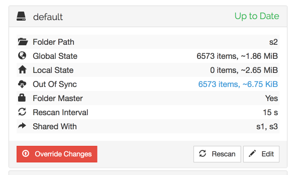

Folder Master
=============

A folder can be set in "master mode" among the folder settings.

.. figure:: foldermaster.png

The intention is for this to be used on devices where a "master copy" of
files are kept - where the files are not expected to be changed on other
devices or where such changes would be undesirable.

In master mode, all changes from other devices in the cluster are
ignored. Changes are still *received* so the folder may become "out of
sync", but no changes will be applied.

When a master folder becomes out of sync, a red "Override Changes"
button is shown at the bottom of the folder details.

Clicking this button will make enforce the master's current state on the
rest of the cluster. Any changes made to files will be overwritten by
the version on the master, any files that don't exist on the master will
be deleted, and so on.
